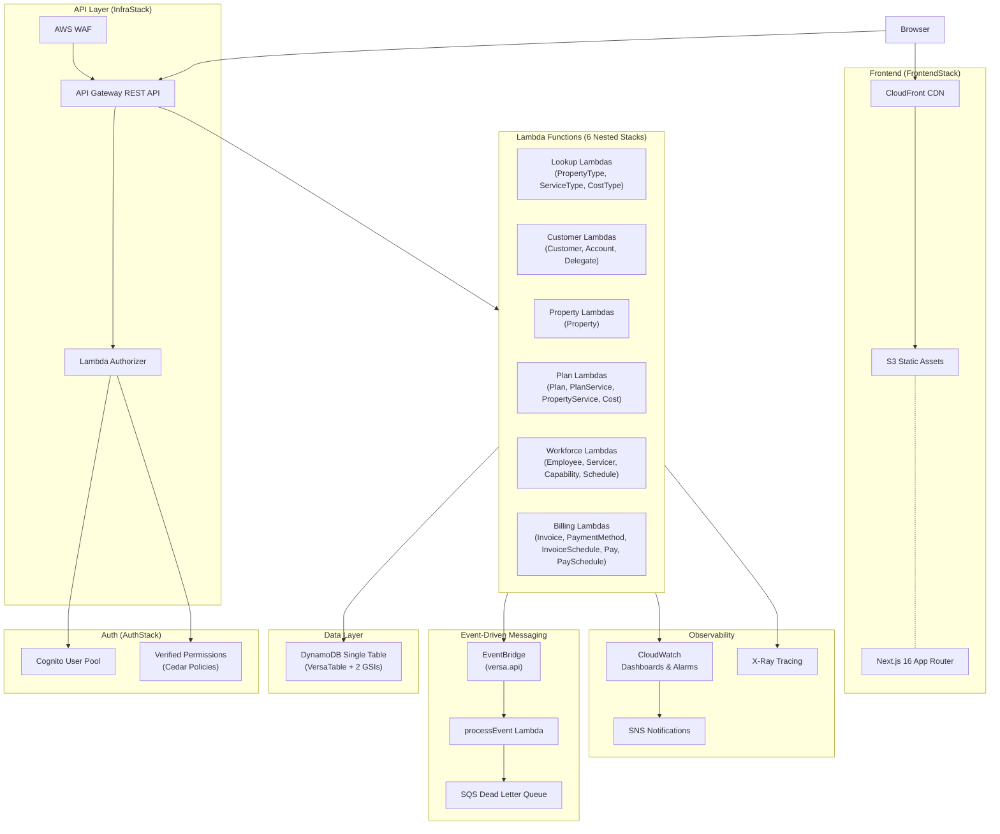

# Versa Application Architecture

Full-stack serverless architecture on AWS.

## Infrastructure Stacks (CDK)

| Stack | Purpose | Naming |
|---|---|---|
| **AuthStack** | Cognito User Pool, 5 groups, Verified Permissions policy store | `VersaAuthStack-{stage}` |
| **InfraStack** | API Gateway, WAF, DynamoDB, Lambda functions (6 nested stacks), EventBridge, CloudWatch | `VersaInfraStack-{stage}` |
| **FrontendStack** | S3 bucket, CloudFront distribution (per-stage) | `VersaFrontendStack-{stage}` |

## Lambda Nested Stacks

Each domain group is deployed as a `LambdaStack` (NestedStack) within InfraStack:

| Stack | Entities |
|---|---|
| **LookupLambdas** | PropertyType, ServiceType, CostType |
| **CustomerLambdas** | Customer, Account, Delegate |
| **PropertyLambdas** | Property |
| **PlanLambdas** | Plan, PlanService, PropertyService, Cost |
| **WorkforceLambdas** | Employee, Servicer, Capability, ServiceSchedule |
| **BillingLambdas** | Invoice, PaymentMethod, InvoiceSchedule, Pay, PaySchedule |

All Lambdas run on Node.js 22 (ARM_64) with X-Ray tracing, DLQ, and auto-granted DynamoDB + EventBridge access.
