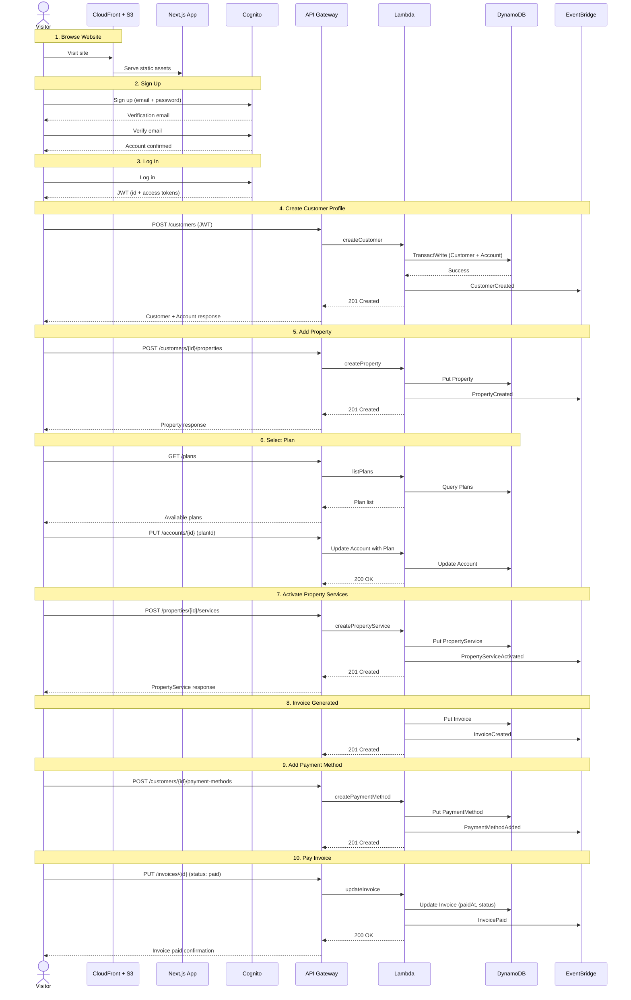

# Customer Journey

Sequence diagram showing the flow from website visitor to paying customer.

## Journey Steps

| Step | Action | API | Event |
|---|---|---|---|
| 1 | Browse website | CloudFront -> S3 | -- |
| 2 | Sign up | Cognito | -- |
| 3 | Log in | Cognito -> JWT | -- |
| 4 | Create profile | `POST /customers` | `CustomerCreated` |
| 5 | Add property | `POST /customers/{id}/properties` | `PropertyCreated` |
| 6 | Select plan | `GET /plans` + `PUT /accounts/{id}` | -- |
| 7 | Activate services | `POST /properties/{id}/services` | `PropertyServiceActivated` |
| 8 | Invoice generated | `POST /invoices` | `InvoiceCreated` |
| 9 | Add payment | `POST /customers/{id}/payment-methods` | `PaymentMethodAdded` |
| 10 | Pay invoice | `PUT /invoices/{id}` | `InvoicePaid` |
