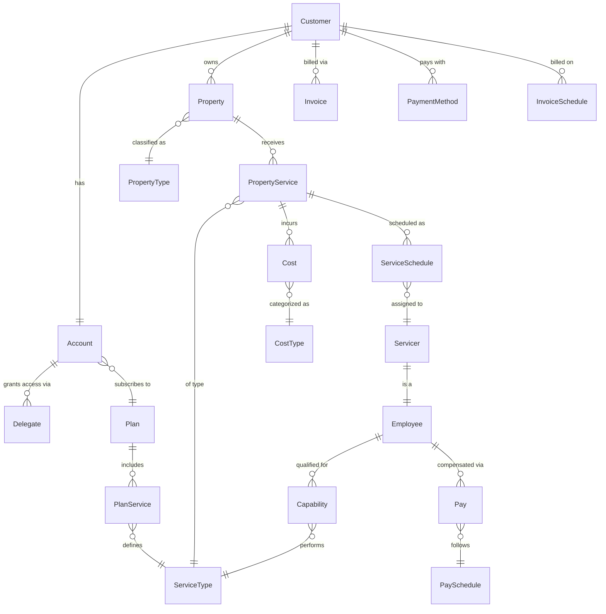

# Versa Entity Model

Customer-centric entity relationship diagram showing all Versa domain entities and their relationships.

## Entity Groups

| Group | Entities |
|---|---|
| **Core** | Customer, Account, Delegate, Property |
| **Plans & Services** | Plan, PlanService, PropertyService, Cost |
| **Lookup** | PropertyType, ServiceType, CostType |
| **Workforce** | Employee, Servicer, Capability, ServiceSchedule |
| **Billing** | Invoice, PaymentMethod, InvoiceSchedule |
| **Payroll** | Pay, PaySchedule |

## Key Relationships

- A **Customer** has exactly one **Account** (created together via TransactWrite)
- An **Account** subscribes to a **Plan**, which defines available services via **PlanService**
- A **Property** receives **PropertyServices**, each of a specific **ServiceType**
- Each **PropertyService** can incur **Costs** and be scheduled as **ServiceSchedules**
- **Employees** become **Servicers** and are assigned to schedules based on their **Capabilities**
- All monetary values (Plan prices, Costs, Invoice totals) are stored in cents
